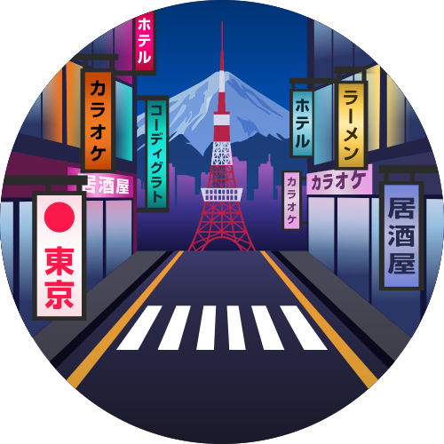

   

<h1 align="center">
Codigrate Themes
</h1>

A carefully crafted collection of themes inspired by nature and iconic cities around the world.
Each theme is designed with balance, readability, and long coding sessions in mind—blending distinctive atmospheres
with thoughtfully tuned colors that reduce eye strain and enhance focus.
Whether you prefer calm, light environments or deep, immersive dark palettes,
these themes aim to make your browser both visually inspiring and comfortably productive.

## Nature

<!-- THEMES-LIST:START - Do not remove or modify this section -->
<!-- prettier-ignore-start -->
<!-- markdownlint-disable -->
<table> 
   <tr>
      <td colspan="2" align="center">
         Light Themes ☀️
      </td>
      <td colspan="2" align="center">
         Dark Themes 🌑
      </td>
   </tr>
   <tr>
      <td align="center">
         
          
         <b>Everest</b>
      </td>
      <td align="left">
         <a href="https://chromewebstore.google.com/detail/kcldghlfficdfjjjcenephkkdkcjngic">
            
             
            
             
            
         </a>
      </td> 
      <td align="center">
         
          
         <b>Aurora Borealis</b>
      </td>
      <td align="left">
         <a href="https://chromewebstore.google.com/detail/ggdeckhhnhopdjnnbngcflijkhnlodfk">
            
             
            
             
            
         </a>
      </td>
   </tr>
   <tr>
      <td align="center">
         
          
         <b>Sakura</b>
      </td>
      <td align="left">
         <a href="https://chromewebstore.google.com/detail/nnildobojpcnfhiihnjklleoimimmkcc">
            
             
            
             
            
         </a>
      </td>
      <td align="center">
         
          
         <b>Sequoia</b>
      </td>
      <td align="left">
         <a href="https://chromewebstore.google.com/detail/elbdggfmdikianlcniekopdflpkppnoj">
            
             
            
             
            
         </a>
      </td>
   </tr>
   <tr>
      <td align="center">
         
          
         <b>Autumn</b>
      </td>
      <td align="left">
         <a href="https://chromewebstore.google.com/detail/fffebmlejekcghghcmiinjamjdcbbojc">
            
             
            
             
            
         </a>
      </td> 
      <td align="center">
         
          
         <b>Roraima</b>
      </td>
      <td align="left">
         <a href="https://chromewebstore.google.com/detail/djgpkjnnddponeeeefijcpballhflkgd">
            
             
            
             
            
         </a>
      </td>
   </tr>
</table>

## Cities

<!-- THEMES-LIST:START - Do not remove or modify this section -->
<!-- prettier-ignore-start -->
<!-- markdownlint-disable -->
<table> 
   <tr>
      <td colspan="2" align="center">
         Light Themes ☀️
      </td>
      <td colspan="2" align="center">
         Dark Themes 🌑
      </td>
   </tr>
   <tr>
      <td align="center">
         
          
         <b>Istanbul</b>
      </td>
      <td align="left">
         <a href="https://chromewebstore.google.com/detail/cjlcpahdceldmbpjbfglhmdlmonjhndf">
            
             
            
             
            
         </a>
      </td>
      <td align="center">
         
          
         <b>Miami</b>
      </td>
      <td align="left">
         <a href="https://chromewebstore.google.com/detail/kcmjhfhghepidmmaklccljefhjgfnlbc">
            
             
            
             
            
         </a>
      </td>
   </tr>
   <tr>
      <td align="center">
         
          
         <b>Rio de Janeiro</b>
      </td>
      <td align="left">
         <a href="https://chromewebstore.google.com/detail/docafppdkimloimielffokjbnpfjaaie">
            
             
            
             
            
         </a>
      </td>
      <td align="center">
         
          
         <b>Paris</b>
      </td>
      <td align="left">
         <a href="https://chromewebstore.google.com/detail/jcneihnpahfoamjdncacanalmdiokkbj">
            
             
            
             
            
         </a>
      </td>
   </tr>
   <tr>
      <td align="center">
         
          
         <b>Tallinn</b>
      </td>
      <td align="left">
         <a href="https://chromewebstore.google.com/detail/efehigdahohhplollagfpnleobcaknpc">
            
             
            
             
            
         </a>
      </td>
      <td align="center">
         
          
         <b>Tokyo</b>
      </td>
      <td align="left">
         <a href="https://chromewebstore.google.com/detail/glgifonajfdadakpjjndpfnmmlaoeglb">
            
             
            
             
            
         </a>
      </td>
   </tr>
</table>

<!-- markdownlint-enable -->
<!-- prettier-ignore-end -->

<!-- THEMES-LIST:END -->

## Contributors

<!-- ALL-CONTRIBUTORS-LIST:START - Do not remove or modify this section -->
<!-- prettier-ignore-start -->
<!-- markdownlint-disable -->
<table>
   <tr>
      <td align="center"><a href="https://github.com/furknyavuz"> <b>Furkan Yavuz</b></a> </td>
      <td align="center"><a href="https://github.com/kerimalp"> <b>Kerim Alp Kaya</b></a> </td>
   </tr>
</table>

<!-- markdownlint-enable -->
<!-- prettier-ignore-end -->

<!-- ALL-CONTRIBUTORS-LIST:END -->

## LICENSE

The source code for this project is released under the [MIT License](LICENSE).

 

<table align="right"><tr><td></td><td><b>Codigrate © 2026</b></td></tr></table>
