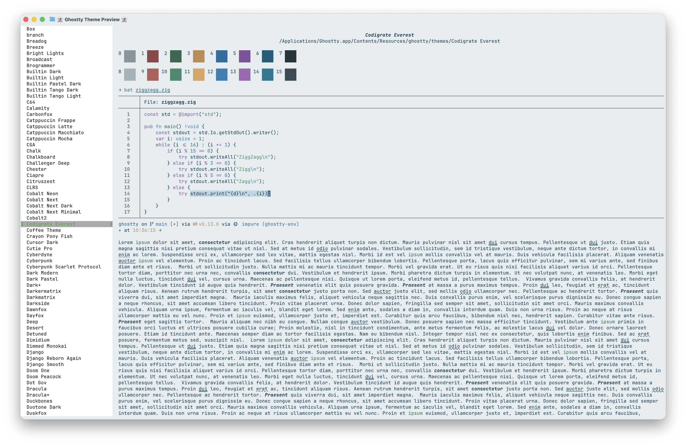

   

<h1 align="center">
Codigrate Themes for Ghostty
</h1>

A carefully crafted collection of Ghostty themes inspired by nature and iconic cities around the world.
Each theme is designed with balance, readability, and long terminal sessions in mind—blending distinctive atmospheres
with thoughtfully tuned colors that make your terminal feel both elegant and comfortable.
Whether you prefer calm, light environments or deep, immersive dark palettes,
these themes aim to make your command line experience visually inspiring and pleasantly focused.

## Getting Started

1. Install **Ghostty** on your system.
2. Copy the theme file you want to use into your Ghostty themes or configuration directory.
3. Open your Ghostty configuration file.
4. Set your active theme to **the name of the theme**.
5. Restart Ghostty or reload the configuration to apply the changes.

## Notes

- These themes are designed for **Ghostty**.
- Theme appearance may vary slightly depending on your operating system, font rendering, terminal settings, and transparency preferences.
- For the most consistent look, use the recommended background and accent colors provided in each palette.

## Nature

   

<h1 align="center">
Everest
</h1>

## Description

Inspired by the majestic heights and serene landscapes of Mount Everest, this light theme brings a crisp and calming
presence to Ghostty. Soft icy tones and clean, airy surfaces evoke snow-covered peaks and clear mountain skies,
creating a terminal experience that feels fresh, focused, and easy on the eyes.

## Screenshots

## Color Palette

<table>
   <tr>
      <td></td>
      <td>Background</td>
      <td>#E4ECEF</td>
   </tr>
   <tr>
      <td></td>
      <td>Selection Background</td>
      <td>#B6D8E5</td>
   </tr>
   <tr>
      <td></td>
      <td>Cursor</td>
      <td>#467196</td>
   </tr>
   <tr>
      <td></td>
      <td>Foreground</td>
      <td>#0E3448</td>
   </tr>
</table>

---

   

<h1 align="center">
Aurora Borealis
</h1>

## Description

Inspired by the natural phenomena of the Aurora Borealis, this dark theme captures the majesty and mystery of the Arctic
night sky. Deep blue-green tones shape the terminal background, while luminous accents echo the ethereal colors of the Northern
Lights, creating an atmosphere that feels immersive, calm, and vibrant.

## Screenshots

## Color Palette

<table>
   <tr>
      <td></td>
      <td>Background</td>
      <td>#E4ECEF</td>
   </tr>
   <tr>
      <td></td>
      <td>Selection Background</td>
      <td>#B6D8E5</td>
   </tr>
   <tr>
      <td></td>
      <td>Cursor</td>
      <td>#467196</td>
   </tr>
   <tr>
      <td></td>
      <td>Foreground</td>
      <td>#0E3448</td>
   </tr>
</table>

---

   

<h1 align="center">
Sakura
</h1>

## Description

Inspired by the enchanting softness of Sakura blossoms, this theme brings a delicate spring atmosphere to Ghostty.
Gentle pinks and muted complementary tones create a serene, polished terminal experience that feels light, graceful,
and easy to live with throughout the day.

## Screenshots

## Color Palette

<table>
   <tr>
      <td></td>
      <td>Background</td>
      <td>#E4ECEF</td>
   </tr>
   <tr>
      <td></td>
      <td>Selection Background</td>
      <td>#B6D8E5</td>
   </tr>
   <tr>
      <td></td>
      <td>Cursor</td>
      <td>#467196</td>
   </tr>
   <tr>
      <td></td>
      <td>Foreground</td>
      <td>#0E3448</td>
   </tr>
</table>

---

   

<h1 align="center">
Sequoia
</h1>

## Description

Inspired by the towering presence and grounded calm of sequoias, this dark theme surrounds Ghostty with rich woodland
tones and subtle green life. It creates a focused, earthy atmosphere that feels steady, deep, and comfortably subdued.

## Screenshots

## Color Palette

<table>
   <tr>
      <td></td>
      <td>Background</td>
      <td>#E4ECEF</td>
   </tr>
   <tr>
      <td></td>
      <td>Selection Background</td>
      <td>#B6D8E5</td>
   </tr>
   <tr>
      <td></td>
      <td>Cursor</td>
      <td>#467196</td>
   </tr>
   <tr>
      <td></td>
      <td>Foreground</td>
      <td>#0E3448</td>
   </tr>
</table>

---

   

<h1 align="center">
Autumn
</h1>

## Description

Inspired by the warm hues and rustic charm of autumn, this light theme brings soft seasonal comfort to Ghostty.
Earthy oranges, mellow neutrals, and crisp contrast create a cozy terminal space that feels welcoming, balanced,
and quietly expressive.

## Screenshots

## Color Palette

<table>
   <tr>
      <td></td>
      <td>Background</td>
      <td>#E4ECEF</td>
   </tr>
   <tr>
      <td></td>
      <td>Selection Background</td>
      <td>#B6D8E5</td>
   </tr>
   <tr>
      <td></td>
      <td>Cursor</td>
      <td>#467196</td>
   </tr>
   <tr>
      <td></td>
      <td>Foreground</td>
      <td>#0E3448</td>
   </tr>
</table>

---

   

<h1 align="center">
Roraima
</h1>

## Description

Inspired by the dramatic sunset over Mount Roraima, this dark theme blends dusky purples, ember-like oranges,
and twilight shadows into a bold yet balanced terminal palette. It brings warmth, depth, and a cinematic sense
of atmosphere to everyday command line work.

## Screenshots

## Color Palette

<table>
   <tr>
      <td></td>
      <td>Background</td>
      <td>#E4ECEF</td>
   </tr>
   <tr>
      <td></td>
      <td>Selection Background</td>
      <td>#B6D8E5</td>
   </tr>
   <tr>
      <td></td>
      <td>Cursor</td>
      <td>#467196</td>
   </tr>
   <tr>
      <td></td>
      <td>Foreground</td>
      <td>#0E3448</td>
   </tr>
</table>

## Cities

   

<h1 align="center">
Istanbul
</h1>

## Description

Inspired by the soft daylight and sea breezes of Istanbul, this theme brings airy turquoise tones and warm historical
accents into Ghostty. It feels fresh, calm, and expressive, offering a refined terminal atmosphere with a distinct coastal elegance.

## Screenshots

## Color Palette

<table>
   <tr>
      <td></td>
      <td>Background</td>
      <td>#E4ECEF</td>
   </tr>
   <tr>
      <td></td>
      <td>Selection Background</td>
      <td>#B6D8E5</td>
   </tr>
   <tr>
      <td></td>
      <td>Cursor</td>
      <td>#467196</td>
   </tr>
   <tr>
      <td></td>
      <td>Foreground</td>
      <td>#0E3448</td>
   </tr>
</table>

---

   

<h1 align="center">
Miami
</h1>

## Description

Inspired by the electric nights and pastel sunsets of Miami, this dark theme fills Ghostty with bold purples,
vivid pinks, and warm neon energy. It creates a playful yet polished terminal experience with strong personality
and clear visual contrast.

## Screenshots

## Color Palette

<table>
   <tr>
      <td></td>
      <td>Background</td>
      <td>#E4ECEF</td>
   </tr>
   <tr>
      <td></td>
      <td>Selection Background</td>
      <td>#B6D8E5</td>
   </tr>
   <tr>
      <td></td>
      <td>Cursor</td>
      <td>#467196</td>
   </tr>
   <tr>
      <td></td>
      <td>Foreground</td>
      <td>#0E3448</td>
   </tr>
</table>

---

   

<h1 align="center">
Rio de Janeiro
</h1>

## Description

Inspired by Rio's lush hills, bright air, and coastal energy, this theme blends soft minty tones with vibrant greens
and clean blues to create a light, refreshing Ghostty experience that feels lively, open, and balanced.

## Screenshots

## Color Palette

<table>
   <tr>
      <td></td>
      <td>Background</td>
      <td>#E4ECEF</td>
   </tr>
   <tr>
      <td></td>
      <td>Selection Background</td>
      <td>#B6D8E5</td>
   </tr>
   <tr>
      <td></td>
      <td>Cursor</td>
      <td>#467196</td>
   </tr>
   <tr>
      <td></td>
      <td>Foreground</td>
      <td>#0E3448</td>
   </tr>
</table>

---

   

<h1 align="center">
Paris
</h1>

## Description

Inspired by candlelit cafes, stone boulevards, and Paris's late-night glow, this theme brings dusky rose,
plum-espresso depth, and soft blush accents into Ghostty. It feels romantic, moody, and elegant without losing clarity.

## Screenshots

## Color Palette

<table>
   <tr>
      <td></td>
      <td>Background</td>
      <td>#E4ECEF</td>
   </tr>
   <tr>
      <td></td>
      <td>Selection Background</td>
      <td>#B6D8E5</td>
   </tr>
   <tr>
      <td></td>
      <td>Cursor</td>
      <td>#467196</td>
   </tr>
   <tr>
      <td></td>
      <td>Foreground</td>
      <td>#0E3448</td>
   </tr>
</table>

---

   

<h1 align="center">
Tallinn
</h1>

## Description

Inspired by Tallinn's crisp light and Baltic calm, this theme pairs cool porcelain tones with Nordic blues for a terminal
experience that feels clean, minimal, and quietly elegant. Subtle contrast keeps everything fresh and readable.

## Screenshots

## Color Palette

<table>
   <tr>
      <td></td>
      <td>Background</td>
      <td>#E4ECEF</td>
   </tr>
   <tr>
      <td></td>
      <td>Selection Background</td>
      <td>#B6D8E5</td>
   </tr>
   <tr>
      <td></td>
      <td>Cursor</td>
      <td>#467196</td>
   </tr>
   <tr>
      <td></td>
      <td>Foreground</td>
      <td>#0E3448</td>
   </tr>
</table>

---

   

<h1 align="center">
Tokyo
</h1>

## Description

Inspired by Tokyo's neon-lit streets and midnight skyline, this theme surrounds Ghostty with deep indigo tones,
electric violets, and cool luminous accents. It feels sleek, atmospheric, and distinctly futuristic while staying polished.

## Screenshots

## Color Palette

<table>
   <tr>
      <td></td>
      <td>Background</td>
      <td>#E4ECEF</td>
   </tr>
   <tr>
      <td></td>
      <td>Selection Background</td>
      <td>#B6D8E5</td>
   </tr>
   <tr>
      <td></td>
      <td>Cursor</td>
      <td>#467196</td>
   </tr>
   <tr>
      <td></td>
      <td>Foreground</td>
      <td>#0E3448</td>
   </tr>
</table>

## Contributors

<!-- ALL-CONTRIBUTORS-LIST:START - Do not remove or modify this section -->
<!-- prettier-ignore-start -->
<!-- markdownlint-disable -->
<table>
   <tr>
      <td align="center"><a href="https://github.com/furknyavuz"> <b>Furkan Yavuz</b></a> </td>
      <td align="center"><a href="https://github.com/kerimalp"> <b>Kerim Alp Kaya</b></a> </td>
   </tr>
</table>
<!-- markdownlint-enable -->
<!-- prettier-ignore-end -->
<!-- ALL-CONTRIBUTORS-LIST:END -->

## LICENSE

The source code for this project is released under the [MIT License](LICENSE).

 

<table align="right">
   <tr>
      <td></td>
      <td><b>Codigrate © 2026</b></td>
   </tr>
</table>